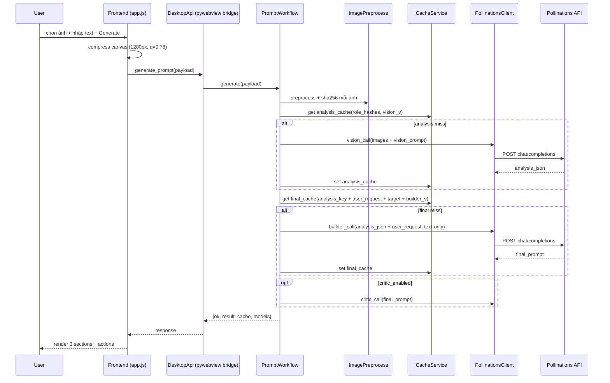

# APP_SKILL — Img automation App

> **Status**: Source of truth duy nhất cho mọi thay đổi codebase từ thời điểm này.  
> **Supersedes**: file:SKILL.md, file:outfit_swap_skill.md, file:REDESIGN_SPEC.md.  
> **Owner**: dự án epic:7fcfbced-af9c-43d4-80ee-76cb515a129a.

Khi có xung đột giữa file này và bất kỳ file markdown cũ nào trong repo, **file này thắng**. Các file cũ chỉ giữ làm lịch sử cho đến khi được xoá ở Wave 5.

---

## 1. Product Identity

```text
Product:        Img automation App
Form factor:    Desktop app (Windows-first), pywebview shell
Backend:        Python 3.13, stdlib + pywebview + Pillow
Frontend:       Plain HTML / CSS / JS (no framework, no bundler)
External API:   Pollinations Chat Completions
External UI:    Open ChatGPT trong Chrome/Edge với profile chọn sẵn
MVP mode:       outfit_swap (identity-preserving outfit transfer)
Future modes:   character_json, product_shots, storyboard, image_to_video, json_to_natural
```

Value proposition: tạo prompt outfit-swap chất lượng cao cho ChatGPT Image / GPT Image / GG Banana từ ảnh model + ảnh outfit + (tuỳ chọn) ảnh background, **giữ identity tuyệt đối, bám sát outfit, tối ưu pollens bằng cache**.

Target users: fashion sellers, TikTok/Shopee shop, AI image creators, lookbook studio.

---

## 2. Non-Negotiables

Bất kỳ PR nào vi phạm các điều dưới đây phải bị reject:

1. MVP là `outfit_swap`. Không biến app thành "general prompt lab" trừ khi spec mới yêu cầu.
2. Image 1 (`role=model`) là nguồn identity duy nhất, ưu tiên tuyệt đối.
3. Image 2 (`role=outfit`) là nguồn outfit duy nhất; không được đổi mặt, giới tính, body, pose, background.
4. Image 3 (`role=background`) là tuỳ chọn, chỉ dùng cho cảnh; nếu thiếu → fallback Image 1 background.
5. Vai trò `makeup`, `pose` đang **inactive** trong MVP. Không gửi lên API, không upload sang ChatGPT.
6. Không default về wording nữ giới (`woman`, `she`, `her`). Default là `the model from Image 1`.
7. Không bao giờ retry lỗi 413 bằng cách âm thầm bỏ ảnh.
8. Không auto-submit ChatGPT. Chỉ mở browser + ghi prompt vào file handoff.
9. API key plain-text **chỉ tồn tại trong RAM**. Không log, không ghi file ngoài `.env` user tự tạo.
10. Output cuối phải đúng format theo `target_model_rule` (mục §6).
11. Không thêm runtime dependency mới ngoài: `pywebview`, `Pillow` (Wave 2). Không Electron, không React, không bundler.

---

## 3. Repository Layout (target sau Wave 5)

```text
app prompt/
├─ app.py                          # pywebview entry + DesktopApi (mỏng)
├─ requirements.txt                # runtime: pywebview, pillow
├─ requirements-dev.txt            # pytest, ruff, mypy, playwright
├─ pyproject.toml                  # ruff/mypy/pytest config
├─ package.json                    # devDependencies: playwright
├─ run_app.ps1
├─ build_exe.ps1
├─ pyinstaller.spec.template       # 1 spec, generator script tạo 4 biến thể
├─ .env.example
├─ .gitignore
├─ APP_SKILL.md                    # file này, render ra repo
├─ README.md                       # ngắn, trỏ về APP_SKILL.md
├─ backend/
│  ├─ __init__.py
│  ├─ config.py                    # AppConfig
│  ├─ constants.py                 # MODE_IDS, MODEL_OPTIONS, ROLE_LABELS, MIME allowlist
│  ├─ desktop_api.py               # tách DesktopApi khỏi app.py
│  ├─ services/
│  │  ├─ __init__.py
│  │  ├─ image_preprocess.py       # Pillow: strip exif, resize, encode, sha256
│  │  ├─ cache_service.py          # 2-tier file cache (analysis + final)
│  │  ├─ pollinations_client.py    # HTTP client + retry policy
│  │  ├─ prompt_workflow.py        # orchestrate vision→builder(→critic)
│  │  └─ chrome_profiles.py        # Chrome/Edge profile discovery
│  └─ prompts/
│     ├─ __init__.py
│     ├─ vision_prompts.py
│     ├─ builder_prompts.py        # switch theo target_model_rule
│     ├─ critic_prompts.py
│     └─ negative_prompts.py
├─ frontend/
│  ├─ index.html
│  ├─ app.js
│  ├─ styles.css
│  └─ i18n/{vi,en}.json            # Wave 4
├─ tests/
│  ├─ test_workflow.py
│  ├─ test_pollinations_client.py
│  ├─ test_image_preprocess.py
│  ├─ test_cache_service.py
│  ├─ test_chrome_profiles.py
│  ├─ test_desktop_api.py
│  ├─ frontend-static-check.mjs
│  ├─ frontend-render-check.mjs
│  └─ frontend-unit.mjs            # node --test cho parsePromptSections, v.v.
└─ .github/workflows/ci.yml
```

---

## 4. Runtime Architecture



Nguyên tắc: **builder không nhận ảnh**, chỉ nhận `analysis_json` + `user_request`. Đây là chìa khoá tiết kiệm pollens vs implementation hiện tại.

---

## 5. Backend Module Contracts

### 5.1 `backend/constants.py` (Wave 1)

```text
MODE_IDS = {"OUTFIT_SWAP": "outfit-swap-json"}   # giữ id legacy cho FE
TARGET_RULES = {"chatgpt_img", "gpt_image", "gg_banana2"}
QUALITY_PROFILES = {"cheap", "balanced", "quality"}
ACTIVE_ROLES = ("model", "outfit", "background")
HIDDEN_ROLES = ("makeup", "pose")
IMAGE_MIME_ALLOWLIST = {"image/jpeg", "image/png", "image/webp"}

MODEL_OPTIONS = [
  {"value": "gpt-5.4-nano",        "label": "GPT-5.4 Nano",        "supports_images": True, "tier": "balanced"},
  {"value": "gpt-5-nano",          "label": "GPT-5 Nano",          "supports_images": True, "tier": "balanced"},
  {"value": "gemini-flash-lite-3.1","label": "Gemini 2.5 Flash Lite","supports_images": True, "tier": "vision"},
  {"value": "mistral-small-3.1",   "label": "Mistral Small 3.1",   "supports_images": False,"tier": "critic"},
]

ROLE_LABELS = {  # text label gửi kèm ảnh trong vision call
  "model":      "REFERENCE 1 - A.1 Identity. ABSOLUTE PRIORITY ...",
  "outfit":     "REFERENCE 2 - A.2 Outfit. VERY HIGH PRIORITY ...",
  "background": "REFERENCE 3 - A.3 Background. OPTIONAL ...",
}

MAX_TOTAL_IMAGE_PAYLOAD_BYTES = 1_200_000   # tính theo decoded bytes
PROMPT_VERSIONS = {"vision": "vision_v1_outfit_strict",
                   "builder": "builder_v1_outfit_lock",
                   "critic":  "critic_v1"}
```

`backend.constants` là nơi duy nhất khai báo các giá trị này. Frontend đọc qua `get_bootstrap()`. Không hardcode `<option>` trong HTML nữa.

### 5.2 `backend/services/image_preprocess.py` (Wave 2)

API:

```text
preprocess(data_url: str, profile: Literal["cheap","balanced","quality"]) -> ProcessedImage
ProcessedImage(jpeg_bytes: bytes, sha256: str, width: int, height: int, payload_bytes: int)
```

Rules:

- Bỏ EXIF, EXIF transpose, convert RGB.
- Long side: `cheap=1024 / balanced=1280 / quality=1536`.
- JPEG quality: `80 / 85 / 88`.
- `sha256` tính trên `jpeg_bytes` đã normalize (đảm bảo cache key ổn định).
- Reject nếu MIME ngoài allowlist hoặc decode lỗi → raise `ImageError`.

### 5.3 `backend/services/cache_service.py` (Wave 2)

API:

```text
analysis_get(key: str) -> dict | None
analysis_set(key: str, value: dict, ttl_days: int = 30) -> None
final_get(key: str) -> dict | None
final_set(key: str, value: dict, ttl_days: int = 7) -> None
purge_expired() -> None
```

- File JSON, lưu tại `%LOCALAPPDATA%/ImgAutomationApp/cache/{tier}/{key}.json` (Windows), `~/.cache/img-automation-app/...` (POSIX).
- Key analysis = `sha256(role_hashes + vision_model + vision_prompt_version + quality_profile)`.
- Key final = `sha256(analysis_key + user_request_normalized + target_rule + builder_model + builder_prompt_version + critic_flag)`.
- Concurrency: ghi qua file tạm + `os.replace`. Không cần lock cross-process cho desktop app 1 user.

### 5.4 `backend/services/pollinations_client.py` (Wave 1+2)

Giữ chữ ký hiện tại, sửa các điểm sau:

- Đọc `Retry-After` cho 429 + 502 + 503; clamp `[5, 90]` giây; tối đa 1 retry mỗi loại.
- Strip Markdown fence (````json`, ````text`) trong `_extract_text`.
- Thêm tham số `purpose: Literal["vision","builder","critic","ping"]` để log + map error message.
- `_map_http_error`: thêm 408, 524 (Cloudflare timeout) → mapping `UPSTREAM_TIMEOUT`.
- Không bao giờ silently drop image.

### 5.5 `backend/services/prompt_workflow.py` (Wave 1 vá, Wave 2 rewrite)

Wave 1 (vá):

- Dọn `import base64` thừa; bỏ `MODEL_OPTIONS` dead code, dùng `constants`.
- Validate `payload.model` ∈ `MODEL_OPTIONS`; trả `UNSUPPORTED_MODEL`.
- Validate `payload.mode` so với `MODE_IDS`.
- `_validate_output` case-insensitive; report `dropped_roles` về FE.
- `_limit_payload`: đo theo decoded bytes; phân biệt error "drop background" (warn) vs "drop required" (fail).

Wave 2 (rewrite chính):

```text
generate(payload):
  ctx = build_context(payload)
  processed = [image_preprocess.preprocess(img, ctx.quality_profile) for img in payload.images]
  analysis_key = cache_keys.analysis(processed, models, versions, quality)
  analysis = cache.analysis_get(analysis_key)
  if not analysis:
      analysis = pollinations.vision(processed, vision_prompts.system, vision_prompts.user(ctx))
      cache.analysis_set(analysis_key, analysis)
  final_key = cache_keys.final(analysis_key, ctx)
  final = cache.final_get(final_key)
  if not final:
      final = pollinations.builder(analysis, builder_prompts.for_target(ctx.target))
      cache.final_set(final_key, final)
  if ctx.critic_enabled:
      final = pollinations.critic(final, critic_prompts.system)
  return ResponseEnvelope(ok=True, result=final, cache={...}, models={...})
```

Response envelope (chuẩn cho FE):

```text
{
  "ok": true,
  "mode": "outfit_swap",
  "target_model_rule": "chatgpt_img",
  "models": {"vision": "...", "prompt_builder": "...", "critic": null},
  "cache": {"analysis_cached": false, "prompt_cached": false,
            "analysis_key": "...", "final_key": "..."},
  "warnings": [{"code": "DROPPED_BACKGROUND", "message": "..."}],
  "result": {
     "output": "MAIN PROMPT:\n...",       // hiện tại; chỉ với target=chatgpt_img
     "structured": { ... },                // với target=gg_banana2
     "negative_prompt": "...",
     "background_only_prompt": "...",
     "reference_binding_instructions": { ... },
     "quality_checks": [...],
     "risk_warnings": [...],
     "reference_count": 2
  }
}
```

### 5.6 `backend/services/chrome_profiles.py`

- Wave 1: giữ nguyên hành vi, nhưng **chỉ expose qua `DesktopApi.refresh_chrome_profiles` khi UI thật sự dùng**. Hiện FE không dùng → tạm ẩn route. Wave 4 quyết định reactivate hoặc xoá.

### 5.7 `backend/desktop_api.py` (Wave 1 — tách khỏi `app.py`)

Methods:

- `get_bootstrap() -> {ok, config, model_options, target_options, quality_profiles, profiles}`
- `generate_prompt(payload) -> ResponseEnvelope`
- `test_api_key({api_key}) -> {ok, message}`
- `open_chatgpt({profile_id, prompt_text}) -> {ok, prompt_file, profile}`

Tất cả method **bắt mọi exception**, trả error envelope thống nhất.

---

## 6. Output Format Theo `target_model_rule`

### 6.1 `chatgpt_img` (default)

3 sections, plain text, không markdown fence:

```text
MAIN PROMPT:
...

NEGATIVE PROMPT:
...

REFERENCE BINDING INSTRUCTIONS:
...
```

Validate (case-insensitive): phải có đủ 3 heading, theo đúng thứ tự.

### 6.2 `gpt_image`

Cùng format 3 sections nhưng wording **concise** (≤ ~250 từ MAIN PROMPT). Builder prompt v1 phải nén.

### 6.3 `gg_banana2`

Output là JSON parseable, theo schema:

```text
{
  "task": "reference-based identity-preserving outfit transfer",
  "subject": { "source": "Image A", "identity_priority": "absolute", ... },
  "outfit":  { "source": "Image B", "fidelity_priority": "absolute", "rules": [...] },
  "background": { "source": "Image C", "instruction": "..." },
  "negative_prompt": "...",
  "quality_rules": [...]
}
```

Validate: `JSON.parse` thành công + có `subject`, `outfit`, `negative_prompt`.

FE renderer:

- `chatgpt_img` / `gpt_image` → 3 collapsible sections (như hiện tại).
- `gg_banana2` → hiển thị JSON pretty + nút "Copy raw JSON".

---

## 7. Identity, Outfit, Background Rules (mọi prompt phải tuân)

### Identity (Image 1)

Phải xuất hiện gần đầu MAIN PROMPT:

- Câu mở: `Identity priority: absolute highest.`
- Preserve: facial structure, face proportions, eyes, nose, lips, jawline, skin tone, gender presentation, body identity nếu visible, hairline, recognizability.
- Cấm: westernize face, beautify thành người khác, identity drift, gender flip.
- Default wording trung tính: `the model from Image 1` / `the subject from Image 1` / `the person in Image 1`.

### Outfit (Image 2)

- Mở: `Reproduce the outfit from Image 2 with maximum fidelity.`
- Match: garment type, fabric, exact visual color (không đoán), fit, silhouette, structure, layering, accessories, styling.
- Cấm wording mơ hồ: `inspired by`, `similar outfit`, `same vibe`, `loosely based on`.
- Cấm thay đổi: face, gender, body, pose, background.

### Background (Image 3, optional)

- Có Image 3: dùng làm scene reference duy nhất.
- Thiếu Image 3: preserve/adapt background của Image 1.
- Cấm: invent unrelated background trừ khi user yêu cầu.

### Pose

- Default: preserve pose Image 1 (hand placement, leg placement, stance, torso, body orientation, expression).
- Chỉ adjust khi user explicitly yêu cầu trong text.

### Negative prompt (mọi target đều phải có)

`backend/prompts/negative_prompts.py` export `OUTFIT_SWAP_NEGATIVE` (chuỗi comma-separated) gồm tối thiểu các concepts trong file:SKILL.md mục "Negative Prompt Requirements" + bổ sung: `text, watermark, logo, oversaturated, posterization`.

Backend phải **append nếu builder bỏ sót** (so sánh chứa keyword `wrong face` + `outfit mismatch`).

---

## 8. Pollinations API Contract

```text
POST https://gen.pollinations.ai/v1/chat/completions
Authorization: Bearer sk_...
Content-Type: application/json
Accept: application/json

Body:
{
  "model": "<value from MODEL_OPTIONS>",
  "messages": [
    {"role": "system", "content": "<purpose-specific system prompt>"},
    {"role": "user", "content": [
       {"type": "text",      "text": "<instruction>"},
       {"type": "text",      "text": "<role label>"},
       {"type": "image_url", "image_url": {"url": "data:image/jpeg;base64,..."}},
       ...
    ]}
  ],
  "temperature": <per purpose>,
  "max_tokens":  <per purpose>,
  "stream": false
}
```

Temperature mặc định:


| Purpose | Temperature | max_tokens |
| ------- | ----------- | ---------- |
| vision  | 0.2         | 2200       |
| builder | 0.35        | 5000       |
| critic  | 0.2         | 2000       |
| ping    | 0           | 8          |


Response extraction thứ tự: `output_text` → `choices[].message.content` → `choices[].text` → `text` → raw text. Nếu rỗng → `EMPTY_RESPONSE`.

Error map (giữ thêm các code đang có):

```text
400/422  -> BAD_REQUEST / UNPROCESSABLE_ENTITY
401/403  -> UNAUTHORIZED / FORBIDDEN (CLOUDFLARE_ACCESS_DENIED nếu body có cloudflare_error)
402      -> INSUFFICIENT_BALANCE
404      -> NOT_FOUND
408/504/524 -> UPSTREAM_TIMEOUT (retry compact 1 lần)
413      -> PAYLOAD_TOO_LARGE  (KHÔNG tự drop ảnh, trả về cho user)
429      -> RATE_LIMITED        (retry sau Retry-After)
502/503  -> BAD_GATEWAY/SERVICE_UNAVAILABLE (retry 1 lần)
```

---

## 9. Frontend Contract

### 9.1 Payload gửi từ FE

```text
{
  "api_key": "sk_...",
  "mode": "outfit-swap-json",
  "model": "gpt-5.4-nano",          // value, không phải label
  "target_model_rule": "chatgpt_img",
  "quality_profile": "balanced",     // mới
  "critic_enabled": false,           // mới
  "style": "...", "aspect_ratio": "...", "resolution": "...", "quality": "...",
  "user_request": "...",
  "images": [
    {"id":"uuid", "role":"model", "name":"...", "type":"image/jpeg",
     "dataUrl":"data:image/jpeg;base64,...", "payloadSize": 12345}
  ]
}
```

### 9.2 DOM IDs (không đổi để tránh regression)

`apiKeyInput, modelSelect, targetSelect, styleSelect, aspectSelect, qualitySelect, resolutionSelect, userRequestInput, modelUpload, outfitUpload, backgroundUpload, modelThumbs, outfitThumbs, backgroundThumbs, statusPill, messageBanner, outputSections, outputBox, heroGenerateBtn, topGenerateBtn, testApiBtn, copyBtn, downloadBtn, handoffBtn, clearOutputBtn, clearModelBtn, clearOutfitBtn, clearBackgroundBtn, toggleKeyBtn`.

Thêm mới được phép (Wave 3+): `qualityProfileSelect, criticToggle, cancelBtn, historyList`.

### 9.3 Behaviour bắt buộc

- `bootstrap()` retry 3 lần × 200ms nếu `window.pywebview` chưa attach. Có fallback timeout 3s → show error + nút "Retry".
- Render `<option>` của `modelSelect`, `targetSelect`, `qualityProfileSelect` từ `bootstrap.model_options` thay vì hardcode.
- Khi `response.warnings` có `DROPPED_BACKGROUND`, show banner `tone="warn"`.
- `parsePromptSections` regex case-insensitive (đồng bộ backend).
- Mọi async handler bọc trong `try/catch`, set status = "error" + show banner khi reject.
- Cancel button (Wave 4): `AbortController.signal` truyền vào `pywebview.api.generate_prompt` không khả thi → workaround dùng `request_id` + endpoint `cancel_request(id)`. Backend giữ flag → bỏ kết quả khi đã cancel.

---

## 10. Build, Run, Package

### Run dev

```text
.\run_app.ps1     # tự uv venv + pip install + python app.py
```

### Build exe

```text
.\build_exe.ps1   # 4 biến thể: onefile/onedir × release/debug
```

Wave 5: gộp 4 spec PyInstaller (`Img automation App*.spec`) thành 1 template + script render. `requirements.txt` chỉ thêm `pillow`. PyInstaller spec phải `--add-data "frontend;frontend"` và `hiddenimports=["PIL","PIL.Image","PIL.ImageOps"]`.

### Cấu hình `.env`

```text
POLLINATIONS_API_KEY=sk_...
POLLINATIONS_ENDPOINT=https://gen.pollinations.ai/v1/chat/completions
DEFAULT_MODEL=gpt-5.4-nano
DEFAULT_QUALITY_PROFILE=balanced
DEFAULT_VISION_MODEL=gemini-flash-lite-3.1
DEFAULT_BUILDER_MODEL=gpt-5.4-nano
REQUEST_TIMEOUT_SECONDS=90
CACHE_DIR=                # optional override
```

---

## 11. Testing Requirements

### Python (pytest)

- `test_workflow.py`:
  - happy path 3 ảnh → ok, response envelope đầy đủ.
  - missing model/outfit → `VALIDATION_ERROR`.
  - mode khác → `UNSUPPORTED_MODE`.
  - model không có trong allowlist → `UNSUPPORTED_MODEL`.
  - cache hit lần 2 → cùng key, không gọi POL.
  - 504 lần 1 → retry compact, lần 2 ok.
  - critic_enabled → 3 calls (vision, builder, critic).
- `test_pollinations_client.py`: error map full status, 429 retry-after, fence stripping, empty response.
- `test_image_preprocess.py`: EXIF transpose, RGBA→RGB, hash ổn định cross-run.
- `test_cache_service.py`: set/get/expire, file atomic replace, key collision.
- `test_chrome_profiles.py`: temp Chrome dir, denied path.
- `test_desktop_api.py`: mock workflow + chrome service, không đụng filesystem thật.

### JavaScript

- `frontend-static-check.mjs` (giữ): tất cả ID `$("...")` có trong HTML, không có element đã remove.
- `frontend-render-check.mjs` (giữ): playwright, screenshot.
- `frontend-unit.mjs` (mới, `node --test`):
  - `parsePromptSections` với case mixed, missing section, fence.
  - `compressImage` smoke với 1×1 px PNG.
  - `buildPayload` snapshot.

### CI

GitHub Actions matrix `windows-latest + ubuntu-latest`:

```text
- python -m pytest -q
- node tests/frontend-static-check.mjs
- node tests/frontend-unit.mjs
- npx playwright install --with-deps chromium
- node tests/frontend-render-check.mjs
- (windows-only) pyinstaller smoke (onefile, no run)
```

---

## 12. Security &amp; Privacy

- API key: chỉ trong RAM (`AppConfig.pollinations_api_key`) hoặc do user nhập trên FE; không log, không gửi đi đâu ngoài Pollinations.
- Allowlist MIME hard-coded ở `_normalize_references`.
- `index.html` thêm meta CSP:
  ```text
  default-src 'self' data:; img-src 'self' data: blob:; style-src 'self' 'unsafe-inline'; script-src 'self';
  ```

  (Lưu ý pywebview chạy local, `connect-src` để default).
- `subprocess.Popen` dùng list args, **không** `shell=True`. Comment giải thích.
- Cache JSON không lưu API key, không lưu raw image bytes (chỉ analysis_json + prompt text).

---

## 13. Roadmap (5 wave)


| Wave                             | Mục tiêu                                                                                     | Trạng thái |
| -------------------------------- | -------------------------------------------------------------------------------------------- | ---------- |
| 1 — Hardening &amp; SSOT         | Vá 13 bug ở §2.B+C của review, gom constants, thêm CSP, validate model                       | TODO       |
| 2 — Vision→Builder + Cache       | Image preprocess (Pillow), 2-tier cache, rewrite workflow, retry policy đúng skill           | TODO       |
| 3 — Multi-target output + Critic | Builder switch theo `target_model_rule`, JSON validator, Pro toggle critic                   | TODO       |
| 4 — UX upgrade                   | Cancel, history, per-section regenerate, i18n, banner cảnh báo dropped role, shortcut        | TODO       |
| 5 — DevEx &amp; CI               | pyproject, requirements-dev, package.json, GitHub Actions, gộp PyInstaller spec, dọn file cũ | TODO       |


Mỗi wave tạo 1 spec con + tickets riêng. Spec con tham chiếu file này.

---

## 14. Acceptance Criteria (rút gọn, dùng làm checklist nghiệm thu)

### Wave 1 done khi

- [ ] Không còn `import base64` thừa, không còn `MODEL_OPTIONS` dead.
- [ ] `<option>` model render từ `get_bootstrap()`.
- [ ] Backend từ chối model lạ với `UNSUPPORTED_MODEL`.
- [ ] `_validate_output` chấp nhận chữ thường.
- [ ] `_normalize_references` reject MIME ngoài allowlist.
- [ ] FE nhận và hiển thị `warnings: [DROPPED_BACKGROUND]`.
- [ ] CSP meta có trong `index.html`.
- [ ] `bootstrap()` retry khi pywebview chưa sẵn sàng.

### Wave 2 done khi

- [ ] `pillow` có trong `requirements.txt`; PyInstaller hiddenimports cập nhật.
- [ ] `image_preprocess.preprocess` test pass.
- [ ] Cache hit lần 2 với cùng ảnh + cùng request → response có `cache.analysis_cached=true` + `cache.prompt_cached=true`, không gọi POL (test mock).
- [ ] Cùng ảnh + request khác → `analysis_cached=true`, `prompt_cached=false`.
- [ ] Builder không nhận `image_url` items.
- [ ] 429 + 503 tôn trọng `Retry-After`.

### Wave 3 done khi

- [ ] `target_model_rule="gg_banana2"` trả `result.structured` JSON parseable.
- [ ] FE render JSON đúng, có nút copy raw.
- [ ] `gpt_image` MAIN PROMPT ngắn hơn `chatgpt_img` ≥ 30%.
- [ ] Toggle Critic gọi đủ 3 model trong 1 request.

### Wave 4 done khi

- [ ] Có nút Cancel hủy được request đang chạy.
- [ ] History list giữ 10 prompt gần nhất, restore được.
- [ ] Ctrl+Enter generate, Esc cancel.
- [ ] Toggle vi/en hoạt động.

### Wave 5 done khi

- [ ] CI xanh trên cả Windows và Linux.
- [ ] PyInstaller spec gộp còn 1 + script generator.
- [ ] `SKILL.md`, `outfit_swap_skill.md`, `REDESIGN_SPEC.md` xoá hoặc thay bằng pointer "see APP_SKILL.md".

---

## 15. Glossary

- **A.1 / Image 1 / model**: ảnh xác định danh tính mẫu.
- **A.2 / Image 2 / outfit**: ảnh nguồn trang phục.
- **A.3 / Image 3 / background**: ảnh nền (optional).
- **target_model_rule**: nơi prompt sẽ được paste (chatgpt_img, gpt_image, gg_banana2).
- **quality_profile**: cheap | balanced | quality (ảnh hưởng resize + JPEG q + cache key).
- **analysis_json**: kết quả vision call, schema theo `vision_prompts` (tham chiếu §8 của file:outfit_swap_skill.md).
- **identity drift**: lỗi mặt mẫu bị thay đổi sang người khác.
- **outfit drift**: lỗi outfit bị đơn giản hoá / restyle.

